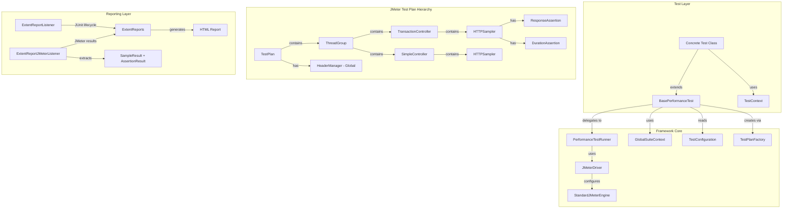
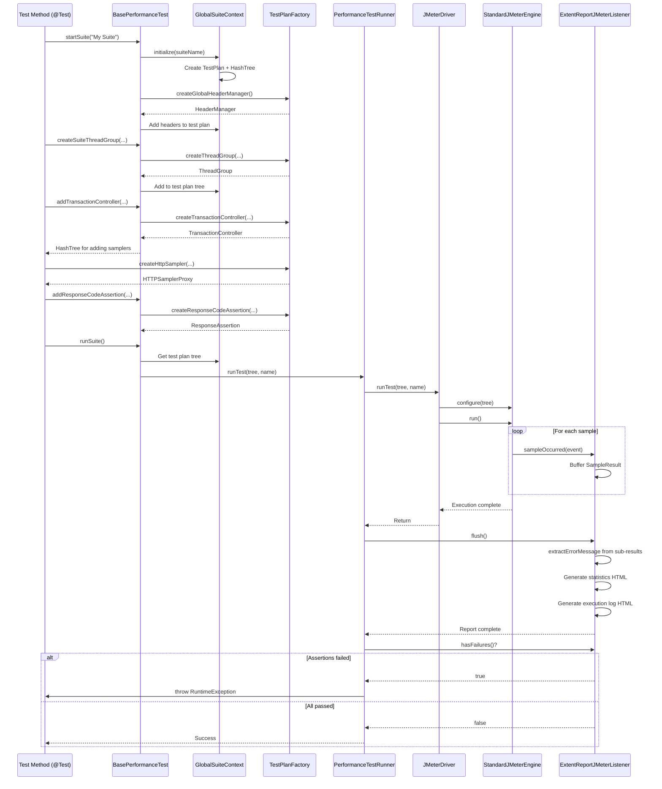
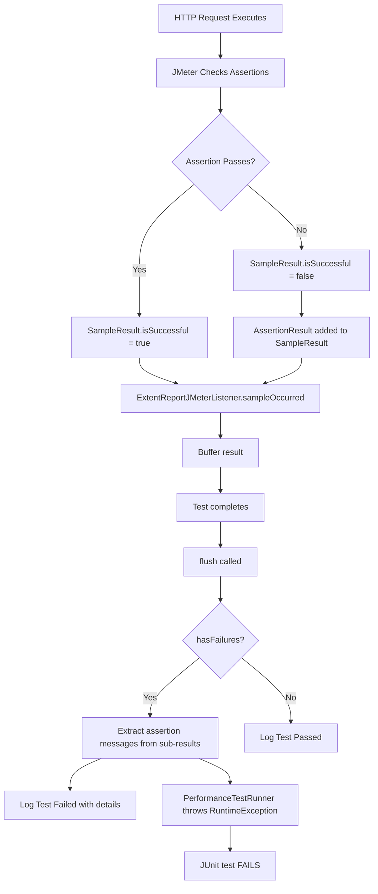

# Performance Testing Framework Architecture

## 1. Overview

This framework is a **programmatic performance testing solution** built with **Java** and **Apache JMeter**. It allows developers and SDETs to write performance tests as standard Java code (JUnit 5 tests) while leveraging the power of JMeter's engine for execution.

### Key Goals

- **Code-First Approach:** Tests are version-controlled, modular, and refactorable Java code
- **IDE Integration:** Configuration and execution can be done directly from IntelliJ/Eclipse
- **No GUI Dependency:** The JMeter GUI is not needed for creating or running tests
- **Full Hierarchy Support:** Complete JMeter test plan hierarchy with controllers and assertions
- **Unified Reporting:** Integrates with ExtentReports for modern, readable HTML reports with detailed error messages
- **Configurable:** Global configuration via `config.properties` for headers, assertions, and test parameters

---

## 2. Technology Stack

| Component | Technology | Version |
|-----------|------------|---------|
| **Language** | Java | 17+ |
| **Core Engine** | Apache JMeter | 5.6.3 |
| **Test Runner** | JUnit 5 | Jupiter |
| **Build Tool** | Maven | 3.x |
| **Reporting** | ExtentReports | 5.x |
| **Logging** | SLF4J | - |

---

## 3. High-Level Architecture



---

## 4. Core Components

### 4.1. `GlobalSuiteContext`

**Package:** `com.perf.framework.GlobalSuiteContext`

**Role:** Thread-safe holder for global test state, enabling the "One Test Plan, Multiple Thread Groups" pattern.

**Key Features:**

- Uses `ThreadLocal<GlobalSuiteContext>` for thread safety in parallel test execution
- Each test thread maintains its own isolated TestPlan and HashTree
- Supports multiple thread groups per test plan

**Key Methods:**

```java
getInstance()                    // Get thread-local instance
initialize(String suiteName)     // Create new TestPlan
getTestPlan()                    // Access current TestPlan
getTestPlanTree()                // Access HashTree
clear()                          // Clean up thread-local state
```

**Usage Pattern:**

```java
GlobalSuiteContext ctx = GlobalSuiteContext.getInstance();
ctx.initialize("My Test Suite");
// Add components to ctx.getTestPlanTree()
```

---

### 4.2. `BasePerformanceTest`

**Package:** `com.perf.framework.BasePerformanceTest`

**Role:** Abstract base class providing high-level API for test creation.

**Responsibilities:**

- Manages suite lifecycle (start/run)
- Provides helper methods for creating JMeter components
- Attaches global headers and standard components automatically
- Integrates with ExtentReports via `@ExtendWith(ExtentReportListener.class)`

**Key Methods:**

#### Suite Management

```java
startSuite(String name)                              // Initialize test plan
runSuite()                                           // Execute test plan
```

#### Thread Group Creation

```java
createSuiteThreadGroup(String name, int threads, 
                       int rampUp, int loops)        // Add thread group to suite
```

#### Controller Helpers

```java
addTransactionController(HashTree parent, String name, 
                         boolean generateParent)     // Add transaction controller
addSimpleController(HashTree parent, String name)    // Add simple controller
addController(HashTree parent, GenericController)    // Add any controller
```

#### Assertion Helpers

```java
addResponseCodeAssertion(HashTree samplerTree, 
                         String... codes)            // Validate HTTP codes
addDurationAssertion(HashTree samplerTree, 
                     long maxMs)                     // Validate response time
addDurationAssertion(HashTree samplerTree, String name, 
                     long maxMs)                     // Named duration assertion
```

---

### 4.3. `TestPlanFactory`

**Package:** `com.perf.framework.TestPlanFactory`

**Role:** Factory class for creating properly configured JMeter components.

**Component Creation Methods:**

#### Core Components

```java
createTestPlan(String name)                          // Create TestPlan
createThreadGroup(String name, int threads, 
                  int rampUp, LoopController)        // Create ThreadGroup
createLoopController(int loops)                      // Create LoopController
createHttpSampler(String name, String domain, 
                  String path, String method)        // Create HTTP sampler
```

#### Controllers

```java
createTransactionController(String name, 
                            boolean generateParent)  // Transaction grouping
createSimpleController(String name)                  // Simple grouping
```

#### Assertions

```java
createResponseCodeAssertion(String name, 
                            String... codes)         // HTTP code validation
createDurationAssertion(String name, long maxMs)     // Response time validation
createResponseAssertion(String name, 
                        String... patterns)          // Generic assertion
```

#### Headers & Configuration

```java
createGlobalHeaderManager(String name)               // Load headers from config
addHeader(HeaderManager mgr, String name, 
          String value)                              // Add single header
```

#### Logging

```java
createResponseLogger(String name)                    // JSR223 response logger
```

---

### 4.4. `TestConfiguration`

**Package:** `com.perf.framework.TestConfiguration`

**Role:** Centralized configuration loader reading from `config.properties`.

**Configuration Categories:**

#### Test Plan Settings

```properties
test.plan.name=Performance Test Plan
target.domain=api.example.com
target.path=/api/v1/endpoint
target.method=GET
```

#### Global Headers (Applied at TestPlan Level)

```properties
global.header.Authorization=Bearer YOUR_TOKEN
global.header.Content-Type=application/json
global.header.Accept=application/json
```

#### Thread Group Settings

```properties
thread.count=10
loop.count=5
ramp.up=2
```

#### Assertion Defaults

```properties
assertion.expected.response.codes=200,201,202
assertion.max.duration.ms=3000
```

#### Reporting

```properties
report.path=report/performance-tests/test-report.html
report.title=Performance Test Report
report.name=Performance Test Execution
report.theme=STANDARD
```

**Key Methods:**

```java
getProperty(String key, String defaultValue)         // Get string property
getIntProperty(String key, int defaultValue)         // Get integer property
```

---

### 4.5. `JMeterDriver`

**Package:** `com.perf.framework.JMeterDriver`

**Role:** Low-level interface to Apache JMeter engine.

**Responsibilities:**

- Bootstrap JMeter environment (creates temp jmeter.home if needed)
- Configure StandardJMeterEngine
- Execute test plans
- Manage JTL result files

**Key Features:**

- **Auto-Bootstrap:** Creates temporary JMeter home with minimal `jmeter.properties` if `jmeter.home` not set
- **JTL Management:** Automatically deletes old JTL files before new test runs
- **Result Collection:** Attaches ResultCollector and Summariser to test plan

---

### 4.6. `PerformanceTestRunner`

**Package:** `com.perf.framework.PerformanceTestRunner`

**Role:** Orchestrates test execution and integrates JMeter with ExtentReports.

**Responsibilities:**

- Attach `ExtentReportJMeterListener` to test plan
- Delegate execution to `JMeterDriver`
- Check for assertion failures and fail JUnit test if any exist
- Handle exceptions and provide meaningful error messages

**Execution Flow:**

```java
1. Attach ExtentReportJMeterListener to tree
2. Call JMeterDriver.runTest()
3. Flush ExtentReportJMeterListener (generate report)
4. Check extentListener.hasFailures()
5. Throw RuntimeException if failures detected
6. Complete successfully if no failures
```

---

### 4.7. `ExtentReportListener`

**Package:** `com.perf.reporting.ExtentReportListener`

**Role:** JUnit 5 extension integrating ExtentReports into test lifecycle.

**Responsibilities:**

- Initialize ExtentReports once per test run
- Create test nodes for each `@Test` method
- Log test outcomes (pass/fail/skip/aborted)
- Extract meaningful error messages from exceptions

**Lifecycle Hooks:**

```java
beforeAll()      // Initialize ExtentReports
beforeEach()    // Create test node
testSuccessful() // Log pass status
testFailed()     // Log fail status with error details
testAborted()    // Log abort status
afterAll()       // Flush report and run post-test hooks
```

**Error Message Extraction:**

- Checks `exception.getMessage()`
- Falls back to exception class name
- Checks cause chain for messages
- Prevents "Test Failed: null" in reports

---

### 4.8. `ExtentReportJMeterListener`

**Package:** `com.perf.reporting.ExtentReportJMeterListener`

**Role:** Captures JMeter sample results and generates execution statistics.

**Responsibilities:**

- Buffer `SampleResult` objects during execution
- Calculate aggregate statistics (Pass/Fail counts, Avg/Min/Max duration)
- Generate HTML tables for summary and detailed execution log
- Extract assertion failure messages from sub-results
- Determine test pass/fail status based on assertion results

**Key Features:**

#### Error Message Extraction

```java
extractErrorMessage(SampleResult)     // Check assertions in result and sub-results
extractAssertionFailures(SampleResult) // Extract assertion failure messages
extractResponseData(SampleResult)      // Extract response body for error context
```

**Hierarchy Handling:**

- Checks parent result for assertions
- **Checks sub-results** (e.g., HTTPSamplers under TransactionController)
- Aggregates multiple assertion failures
- Falls back to response codes if no assertions found

**Statistics Generated:**

- Total samples executed
- Pass/Fail counts
- Average/Min/Max response times
- Detailed execution log with:
  - HTTP Method badge (color-coded)
  - Request URL
  - Response code (green for success, red for failure)
  - Response time

---

## 5. JMeter Test Plan Hierarchy

Our framework supports the complete JMeter hierarchy:

```
TestPlan (Global)
├── HeaderManager (Global Headers from config)
├── ThreadGroup 1
│   ├── TransactionController
│   │   ├── HTTPSampler
│   │   │   ├── ResponseCodeAssertion
│   │   │   └── DurationAssertion
│   │   └── HTTPSampler
│   │       └── ResponseCodeAssertion
│   └── SimpleController
│       └── HTTPSampler
└── ThreadGroup 2
    └── TransactionController
        └── HTTPSampler
```

### Component Roles

| Component | Purpose | When to Use |
|-----------|---------|-------------|
| **TestPlan** | Root container for entire test | Created once per suite via `startSuite()` |
| **HeaderManager** | Apply headers to all requests | Configured globally via config.properties |
| **ThreadGroup** | Define user load profile | Create one per user type/scenario |
| **TransactionController** | Group samplers, measure cumulative time | Logical business transactions |
| **SimpleController** | Group samplers without timing | Organizational grouping |
| **HTTPSampler** | Execute HTTP request | Each API call |
| **ResponseCodeAssertion** | Validate HTTP status codes | Verify expected response codes |
| **DurationAssertion** | Validate response time | Enforce performance SLAs |

---

## 6. Test Execution Flow



---

## 7. Configuration Management

### Global Headers Strategy

**Before (Per Thread Group):**

```java
// ❌ Old: Headers created per thread group
HeaderManager headers = createHeaderManager(name, token);
threadGroupTree.add(headers);
```

**After (Global Test Plan Level):**

```java
// ✅ New: Headers created once at test plan level
startSuite("My Suite");  // Automatically attaches global headers
```

**Benefits:**

- ✅ **DRY:** Headers defined once in config.properties
- ✅ **Efficient:** Applied once at test plan level
- ✅ **Maintainable:** Change in one place affects all requests
- ✅ **Flexible:** Can still override per request if needed

### Configuration Precedence

1. **Global Defaults** (in config.properties)
2. **Test-Specific** (programmatic overrides in test code)
3. **Runtime** (Maven system properties via `-D`)

---

## 8. Error Handling & Reporting

### Assertion Failure Flow



### Error Message Extraction

The framework extracts meaningful error messages at multiple levels:

1. **JMeter Assertion Failures:**
   - Checks `SampleResult.getAssertionResults()`
   - **Checks sub-results** for assertions (TransactionController hierarchy)
   - Extracts `AssertionResult.getFailureMessage()`
   - Falls back to `AssertionResult.getName()`

2. **JUnit Test Failures:**
   - Checks `Throwable.getMessage()`
   - Falls back to exception class name
   - Checks cause chain for messages
   - Prevents null error messages

---

## 9. Usage Patterns

### Basic HTTP Test

```java
@ExtendWith(ExtentReportListener.class)
class SimpleAPITest extends BasePerformanceTest {
    
    @Test
    void testGetUsers() {
        startSuite("User API Test");
        
        TestContext ctx = createSuiteThreadGroup("API Users", 10, 2, 5);
        HashTree threadTree = ctx.getThreadGroupTree();
        
        HTTPSamplerProxy sampler = TestPlanFactory.createHttpSampler(
            "GET /users",
            "api.example.com",
            "/api/v1/users",
            "GET"
        );
        
        HashTree samplerTree = threadTree.add(sampler);
        addResponseCodeAssertion(samplerTree, "200");
        addDurationAssertion(samplerTree, 2000);
        
        runSuite();
    }
}
```

### Hierarchical Test with Controllers

```java
@Test
void testUserWorkflow() {
    startSuite("E-Commerce Workflow");
    
    TestContext ctx = createSuiteThreadGroup("Shoppers", 50, 10, 1);
    HashTree threadTree = ctx.getThreadGroupTree();
    
    // Transaction 1: Browse Products
    HashTree browseTxn = addTransactionController(threadTree, "Browse Products", true);
    
    HTTPSamplerProxy listProducts = TestPlanFactory.createHttpSampler(
        "GET /products", "shop.com", "/api/products", "GET");
    HashTree listTree = browseTxn.add(listProducts);
    addResponseCodeAssertion(listTree, "200");
    
    HTTPSamplerProxy viewProduct = TestPlanFactory.createHttpSampler(
        "GET /product/123", "shop.com", "/api/products/123", "GET");
    HashTree viewTree = browseTxn.add(viewProduct);
    addResponseCodeAssertion(viewTree, "200");
    addDurationAssertion(viewTree, 1500);
    
    // Transaction 2: Checkout
    HashTree checkoutTxn = addTransactionController(threadTree, "Checkout", true);
    
    HTTPSamplerProxy addCart = TestPlanFactory.createHttpSampler(
        "POST /cart", "shop.com", "/api/cart", "POST");
    HashTree cartTree = checkoutTxn.add(addCart);
    addResponseCodeAssertion(cartTree, "201");
    
    HTTPSamplerProxy checkout = TestPlanFactory.createHttpSampler(
        "POST /checkout", "shop.com", "/api/checkout", "POST");
    HashTree checkoutTree = checkoutTxn.add(checkout);
    addResponseCodeAssertion(checkoutTree, "200", "201");
    addDurationAssertion(checkoutTree, "Checkout SLA", 3000);
    
    runSuite();
}
```

### Multi-Thread Group Test

```java
@Test
void testMixedLoad() {
    startSuite("Mixed Load Test");
    
    // Browser Traffic
    TestContext browsers = createSuiteThreadGroup("Browsers", 20, 5, 10);
    HashTree browserTree = browsers.getThreadGroupTree();
    // ... add browser samplers
    
    // API Traffic
    TestContext apiUsers = createSuiteThreadGroup("API Users", 50, 10, 20);
    HashTree apiTree = apiUsers.getThreadGroupTree();
    // ... add API samplers
    
    // Admin Traffic
    TestContext admins = createSuiteThreadGroup("Admins", 2, 1, 5);
    HashTree adminTree = admins.getThreadGroupTree();
    // ... add admin samplers
    
    runSuite();  // Executes all thread groups concurrently
}
```

---

## 10. Best Practices

### Component Naming

✅ **Always name components for traceability:**

```java
// Good
addTransactionController(tree, "Login Flow", true);
HTTPSamplerProxy sampler = createHttpSampler("POST /login", ...);
addDurationAssertion(tree, "Login SLA", 2000);

// Avoid
addTransactionController(tree, "txn1", true);  // Not descriptivecreateHttpSampler("sampler", ...);           // Too generic
```

### Assertion Strategy

- **Always add assertions** to validate correctness
- Use **response code** assertions for HTTP status validation
- Use **duration** assertions to enforce performance SLAs
- Add **custom assertions** for business logic validation

### Configuration

- **Centralize** common values in config.properties
- Use **global headers** for authentication
- Define **assertion thresholds** in configuration
- Keep **test-specific** values in test code

### Error Handling

- Let assertions fail naturally
- Check ExtentReports for detailed error messages
- Use named assertions for clarity
- Review sub-result assertions in transactions

---

## 11. Troubleshooting

### Common Issues

| Issue | Cause | Solution |
|-------|-------|----------|
| "Test Failed: null" in reports | Exception getMessage() returns null | Fixed: Framework extracts from cause chain |
| Assertion failures not failing tests | No failure detection | Fixed: `hasFailures()` check added |
| Headers not applied | Per-thread-group approach | Fixed: Global headers at test plan level |
| Assertion messages missing | Only checking parent results | Fixed: Check sub-results for assertions |

### Debug Tips

1. **Check JTL file:** `logs/test_result.jtl` for raw JMeter output
2. **Review ExtentReport:** `report/performance-tests/test-report.html` for detailed execution log
3. **Enable debug logging:** Set `log.level=DEBUG` in config.properties
4. **View test hierarchy:** Check component names in report to verify structure

---

## 12. Future Enhancements

- [ ] Support for CSV data sets
- [ ] Support for JSON extractors and variables
- [ ] Pre/post processors (BeanShell, JSR223)
- [ ] Timer support (Constant, Gaussian, etc.)
- [ ] Distributed execution support
- [ ] Integration with CI/CD pipelines (Jenkins, GitLab CI)
- [ ] Performance trend analysis over time
- [ ] Custom assertion types

---

## 13. Summary

This framework provides a **production-ready, code-first approach** to performance testing with:

✅ **Complete JMeter Hierarchy:** TestPlan → ThreadGroup → Controllers → Samplers → Assertions  
✅ **Global Configuration:** Centralized header and assertion management  
✅ **Rich Reporting:** ExtentReports with detailed error messages and statistics  
✅ **Developer-Friendly:** Write tests as Java code in your IDE  
✅ **Robust Error Handling:** Meaningful error messages from assertions and exceptions  
✅ **Scalable:** Support for multiple thread groups and complex scenarios

The architecture enables teams to build maintainable, version-controlled performance test suites that integrate seamlessly with existing Java development workflows.
