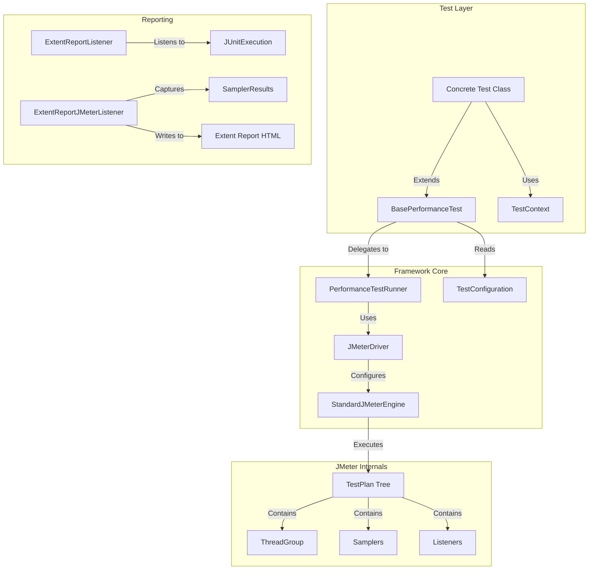

# Performance Testing Framework Architecture

## 1. Overview

This framework is a **programmatic performance testing solution** built with **Java** and **Apache JMeter**. It allows developers and SDETs to write performance tests as standard Java code (JUnit 5 tests) while leveraging the power of JMeter's engine for execution.

Key goals:

- **Code-First Approach:** Tests are version-controlled, modular, and refactorable Java code.
- **IDE Integration:** configurations and executions can be done directly from IntelliJ/Eclipse.
- **No GUI Dependency:** The JMeter GUI is not needed for creating or running tests.
- **Unified Reporting:** Integrates with ExtentReports for modern, readable HTML reports.

## 2. Technology Stack

- **Language:** Java 17+
- **Core Engine:** Apache JMeter 5.6.3
- **Test Runner:** JUnit 5 (Jupiter)
- **Build Tool:** Maven
- **Reporting:** ExtentReports 5 & JMeter .jtl logs

## 3. High-Level Architecture

## 4. Core Components

### 4.1. `GlobalSuiteContext` (`com.perf.framework.GlobalSuiteContext`)

- **Role:** The Thread-Safe holder for the global test state.
- **Responsibility:** Enables the "One Test Plan, Multiple Thread Groups" pattern while supporting parallel test execution.
- **Key Mechanism:** Uses `ThreadLocal<GlobalSuiteContext>` to ensure that when tests run in parallel (e.g., via Maven Surefire), each test thread maintains its own isolated Test Plan and Tree.
- **Usage:**
  - `startSuite(name)`: Initializes the ThreadLocal context.
  - `createSuiteThreadGroup(...)`: Adds a Thread Group to the current context's tree.
  - `runSuite()`: Executes the plan stored in the current context.

### 4.2. `BasePerformanceTest` (`com.perf.framework.BasePerformanceTest`)

**Role:** The abstraction layer for test authors.

- **Responsibility:** Hides the complexity of created raw JMeter objects.
- **Key Methods:**
  - `startSuite(name)` / `runSuite()`
  - `createSuiteThreadGroup(...)`
  - `createHttpSampler(...)`

### 4.3 `ExtentReportJMeterListener`

- **Role:** Captures JMeter `SampleResult` objects during execution.
- **Statistics:** Calculates generic metrics (Avg/Min/Max Duration, Pass/Fail Counts) and appends a summary table to the ExtentReport before the detailed execution log.

## 5. Execution Flow

1. **JUnit Start:** The test method (annotated with `@Test`) begins execution.
2. **Context Init:** `startSuite()` is called, creating a fresh `GlobalSuiteContext` for the current thread.
3. **Assembly:**
    - `createSuiteThreadGroup()` is called one or more times to add independent load profiles (Browsers, API Users, etc.).
    - Samplers and Controllers are added to these thread groups.
4. **Execution:** `runSuite()` is called.
    - The `PerformanceTestRunner` retrieves the assembled tree from the context.
    - `JMeterDriver` launches the engine.
5. **Reporting:**
    - `ExtentReportJMeterListener` captures results in real-time.
    - Final statistics are calculated and written to the HTML report.
    - `.jtl` logs represent the raw data.
